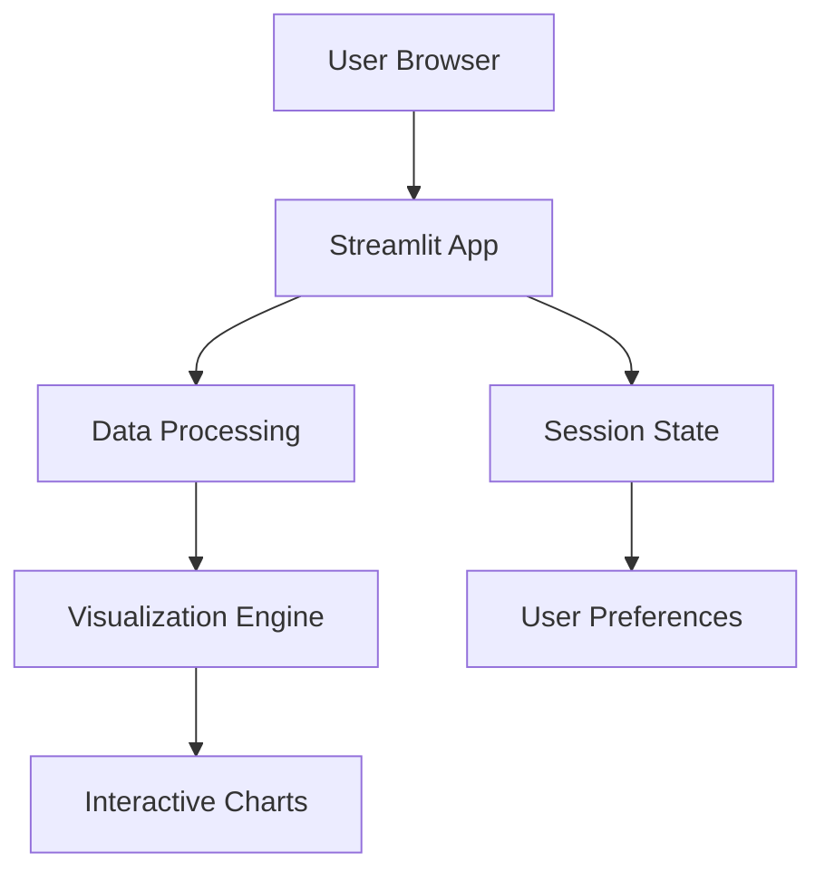

# 📊 Data Visualization Dashboard

A Streamlit web application for interactive data visualization and analysis.

## 🚀 Live Demo
[](https://your-app-name.streamlit.app/)

## 📋 Features
- 📈 Interactive data visualizations with Plotly
- 📁 CSV/Excel file upload support
- 🔍 Real-time data filtering
- 📊 Multiple chart types (Bar, Line, Scatter, Histogram)
- 📱 Responsive design for mobile devices
- 🌙 Dark/Light theme toggle

## 🏗️ Architecture


# this is streamlit code of student form 
```
import streamlit as st 
    st.set_page_config(page_title="Student Form", layout="centered")

st.title("Student Registration Form")

# ---- FORM ----   
with st.form("student_form"):
    name = st.text_input("Student Name")
    email = st.text_input("Email")
    age = st.number_input("Age", min_value=1, max_value=100)
    gender = st.selectbox("Gender", ["Male", "Female", "Other"])
    course = st.selectbox(
        "Course",
        ["BCA", "BSC", "BCOM", "BA", "BTech"]
    )
    skills = st.multiselect(
        "Skills",
        ["Python", "Java", "AWS", "Docker", "Linux"]
    ) ```

    submit = st.form_submit_button("Submit")

```
```
streamlit run student_form.py


